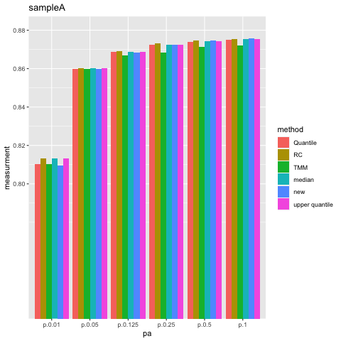
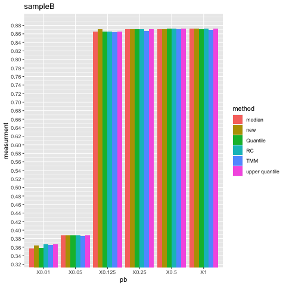
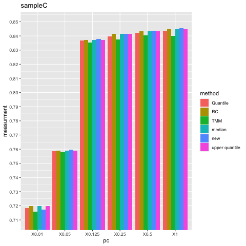
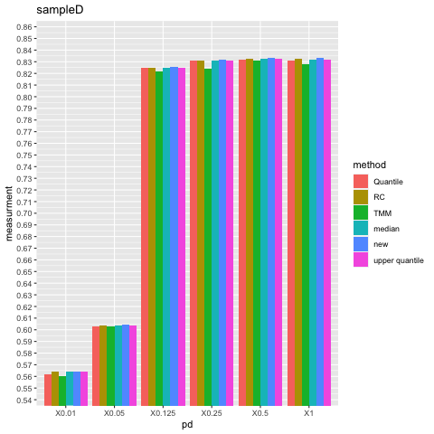
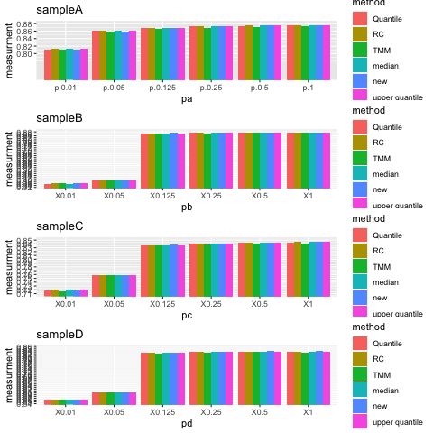

Select one sample A, one sample B, one sample C and one sample D.Then simulate their read counts by Binom(n,0.5), Binom(n,0.25),Binom(n,0.125),Binom(n,0.05),Binom(n,0.01) and get a new dataset. Use upper quantile, median, quantile, TMM, Deseq and new method to do normalization.  Then calculate the spearman correlation with TaqMan qRT-PCR data and get results. At last, make barplots to compare the performance of different normalization methods.

as the results shown, the new methods for normalization does not have a obvious distinct advantage.

